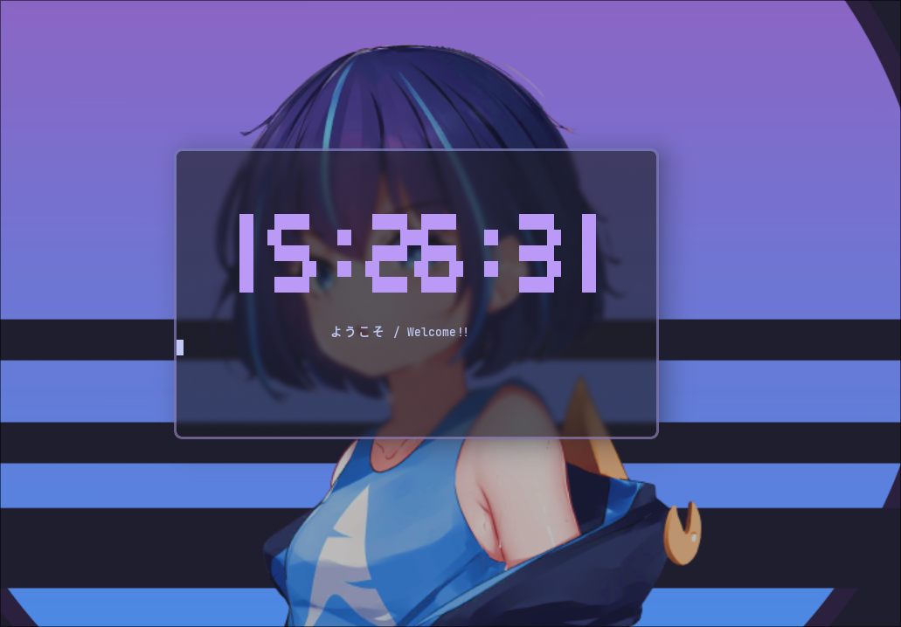

<p align="center">
  
</p>

<h1 align="center">cli-clock</h1>

<p align="center">
  <a href="https://github.com/doremire/cli-clock"></a>
  <a href="https://github.com/doremire/cli-clock"></a>
  <a href="https://github.com/doremire/cli-clock/issues"></a>
  <a href="https://github.com/doremire/cli-clock/blob/main/LICENSE"></a>
  <br>
  <a href="README.md"></a>
  <a href="README_EN.md"></a>
</p>

<p align="center">
  <strong>初めてのC言語のプロジェクト</strong>
  <br>
tty-clockをリスペクトしたcliアプリケーション
  <br>
  <br>
  <a href="https://github.com/doremire/cli-clock/wiki">ドキュメント</a>
  ·
  <a href="https://github.com/doremire/cli-clock/issues">バグを報告</a>
  ·
  <a href="https://github.com/doremire/cli-clock/issues">新機能の提案</a>
</p>

<br>

<br>
<p align="center">
    <em>言語を選択してください:</em>
  <a href="README.md">🇯🇵 日本語</a> |
  <a href="README_EN.md">🇺🇸 English</a>
</p>

## 特徴

アスキーアートで書かれたグラフィカルな時計です

- C言語でローコードで書かれた軽量なシステム

## インストール

```
sudo make install
```
## 使用法

```

    cli-clock -c 5 -t "🪐 おやすみなさい"

    ----------------------------------------------------------------
    オプション:

    -h ヘルプ
    −c [1-7] 色の変更
    −t "text" 文字の追加

 ```
