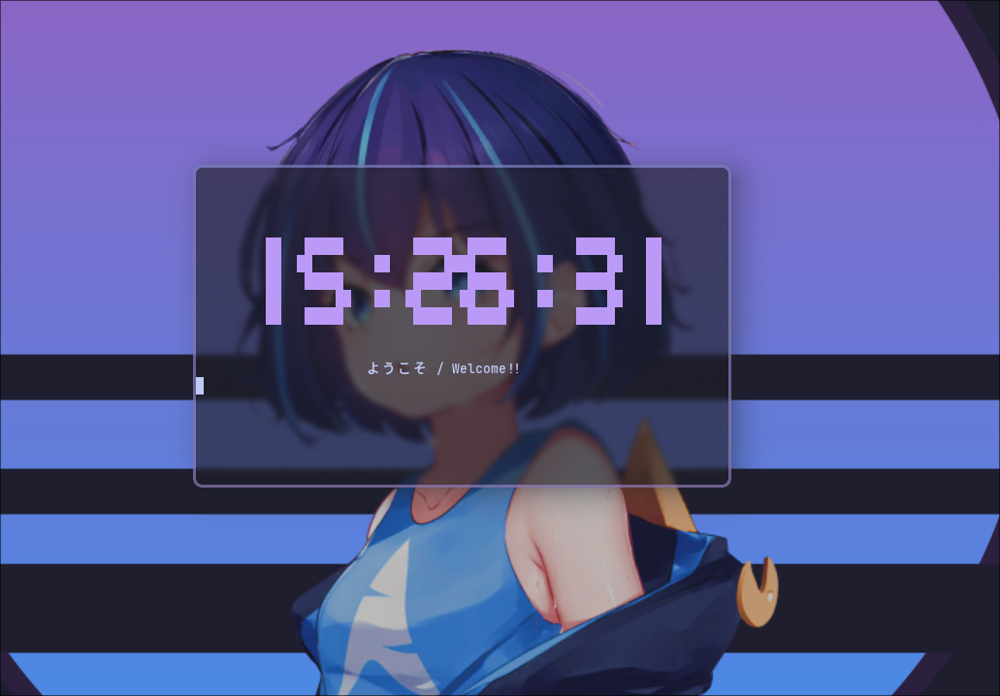

<p align="center">
  
</p>

<h1 align="center">cli-clock</h1>

<p align="center">
  <a href="https://github.com/doremire/cli-clock"></a>
  <a href="https://github.com/doremire/cli-clock"></a>
  <a href="https://github.com/doremire/cli-clock/issues"></a>
  <a href="https://github.com/doremire/cli-clock/blob/main/LICENSE"></a>
  <br>
  <a href="README.md"></a>
  <a href="README_EN.md"></a>
</p>

<p align="center">
  <strong>First C Language Project</strong>
  <br>
  CLI application inspired by tty-clock
  <br>
  <br>
  <a href="https://github.com/doremire/cli-clock/wiki">Documentation</a>
  ·
  <a href="https://github.com/doremire/cli-clock/issues">Report Bugs</a>
  ·
  <a href="https://github.com/doremire/cli-clock/issues">Propose New Features</a>
</p>

<br>

<br>
<p align="center">
    <em>Select Your Language:</em>
  <a href="README.md">🇯🇵 Japanese</a> |
  <a href="README_EN.md">🇺🇸 English</a>
</p>

## Features

A graphical clock written in ASCII art.

- Lightweight system written in low-code C language.

## Installation

```
sudo make install
```

## Usage

```

    cli-clock -c 5 -t "🪐 Good night"

    ----------------------------------------------------------------
    Options:

    -h Help
    -c [1-7] Change colors
    -t "text" Add text

```
